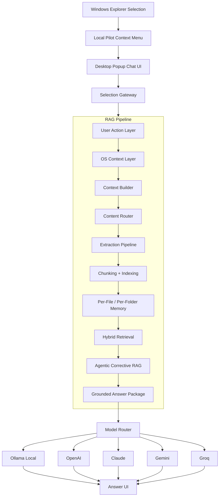

# Local Pilot

Local Pilot is an OS-native contextual AI assistant for files, folders, and codebases.

The core workflow is simple:

```text
Right click a file or folder -> Local Pilot opens -> ask questions -> get grounded answers with sources
```

Instead of opening a chatbot, uploading files, and explaining context manually, Local Pilot starts from the file or folder the user is already working with.

## Current Stage

Stage 1 is a Windows-first MVP.

Currently implemented:

- Windows Explorer right-click integration
- Desktop popup chat UI
- Local Ollama support
- Optional OpenAI, Claude, Gemini, and Groq provider settings
- Setup checker for Python, context menu, Ollama, provider, and local storage
- PDF, DOCX, PPTX, XLSX, TXT, Markdown, JSON, CSV, SQL, log, and code-file extraction
- Folder scanning with ignored build/cache/binary folders
- Local SQLite memory for indexed chunks and chat history
- Per-file and workspace-style answering
- Source references for answers

Not yet included:

- Packaged installer
- Modern Windows 11 main context-menu shell extension
- Image OCR
- Old `.doc` and `.ppt` parsing
- Full vector database retrieval
- Autonomous code-editing agent
- macOS Finder or Linux file-manager integration

## Product Architecture

This project combines two ideas:

1. A real working Local Pilot desktop app.
2. A clean layered agentic pipeline inspired by the 7-layer architecture plan.

The final product architecture is:

```text
Windows Explorer
    |
    v
Right-Click Context Menu
    |
    v
Local Pilot Desktop App
    |
    v
Selection Gateway
    |
    v
RAG Pipeline
    |
    v
Model Router
    |
    v
Ollama / OpenAI / Claude / Gemini / Groq
    |
    v
Chat UI + Sources + Actions + History
```

## Internal RAG Pipeline

The RAG pipeline is the brain of Local Pilot. Context building, extraction, indexing, memory, retrieval, and correction all belong inside this pipeline.

```text
RAG Pipeline
    |
    v
User Action Layer
    |
    v
OS Context Layer
    |
    v
Context Builder
    |
    v
Content Router
    |
    v
Extraction Pipeline
    |
    v
Chunking + Indexing
    |
    v
Per-File / Per-Folder Memory
    |
    v
Hybrid Retrieval
    |
    v
Agentic Corrective RAG
    |
    v
Grounded Answer Package
```

### Layer Responsibilities

| Layer | Responsibility |
| --- | --- |
| User Action Layer | Receives the selected file, files, or folder from Explorer. |
| OS Context Layer | Normalizes paths and captures platform/context-menu metadata. |
| Context Builder | Builds the workspace context: selected item, parent folder, neighboring files, and previous memory. |
| Content Router | Chooses the correct processor for PDFs, Office files, text, code, folders, and future images. |
| Extraction Pipeline | Converts supported files into clean text plus metadata. |
| Chunking + Indexing | Splits extracted content into searchable source chunks and stores them locally. |
| Memory | Keeps per-file, per-folder, and workspace chat history. |
| Hybrid Retrieval | Finds the best evidence using lexical search now, with embeddings/reranking planned. |
| Agentic Corrective RAG | Generates an answer, checks grounding, and retries or says it cannot find enough evidence. |
| Answer Package | Returns answer text, source references, confidence signals, and suggested actions. |

## Pipeline Diagram



## Memory Design

Local Pilot stores memory locally in SQLite:

```text
data/local_pilot.db
```

The memory model is:

```text
File memory
    - path
    - content hash
    - extracted chunks
    - metadata
    - chat history for that file

Folder memory
    - folder path
    - folder structure
    - indexed supported files
    - workspace chat history

Workspace memory
    - one file
    - multiple selected files
    - one folder
    - future mixed selections
```

This means each selected item can have its own stored knowledge, while multi-file and folder workflows can answer using the whole workspace.

## Model Routing

Local Pilot is local-first.

```text
Default: Ollama
Optional: OpenAI / Claude / Gemini / Groq
Mode: auto with cloud fallback only if enabled
```

Provider flow:

```text
Question + retrieved chunks
    |
    v
Model Router
    |
    +--> Ollama if local mode is selected
    +--> Cloud provider if selected and API key exists
    +--> Cloud fallback only if the user enabled fallback
```

Privacy rule:

```text
Local mode keeps selected context on this computer.
Cloud mode can send selected retrieved chunks to the chosen API provider.
```

## Codebase Direction

The current app works, but the long-term codebase should be organized around a clean pipeline module:

```text
backend/
  local_pilot_popup.py
  app/
    pipeline/
      state.py
      orchestrator.py
      user_action.py
      os_context.py
      context_builder.py
      content_router.py
      extraction.py
      indexing.py
      retrieval.py
      agent.py
      response.py
    extractors.py
    rag_engine.py
    rag_store.py
    settings_store.py
    setup_check.py
    llm/
      router.py
      ollama_client.py
      openai_client.py
      anthropic_client.py
      gemini_client.py
      groq_client.py
```

The current MVP can keep working while logic is gradually moved into `backend/app/pipeline/`.

## Current Project Structure

```text
local-pilot/
  backend/
    app/
      main.py
      rag_engine.py
      setup_check.py
      context_collector.py
      extractors.py
      folder_scanner.py
      rag_store.py
      settings_store.py
      schemas.py
      llm/
    local_pilot_popup.py
    local_pilot_cli.py
  desktop/
    registry/
      install-local-pilot-dev.ps1
      check-local-pilot-dev.ps1
      add-local-pilot-dev.reg
      remove-local-pilot.reg
  data/
    local_pilot.db
  docs/
  requirements.txt
```

## Run The Desktop MVP

Install dependencies:

```bash
pip install -r requirements.txt
```

Install the development context-menu entry:

```powershell
powershell.exe -ExecutionPolicy Bypass -File desktop\registry\install-local-pilot-dev.ps1
```

Check setup:

```powershell
powershell.exe -ExecutionPolicy Bypass -File desktop\registry\check-local-pilot-dev.ps1
```

Then:

1. Right click a file or folder.
2. On Windows 11, choose `Show more options` if needed.
3. Click `Local Pilot`.
4. Ask questions in the popup chat window.

## Ollama Setup

Local Pilot uses Ollama by default.

Small fast model:

```bash
ollama pull gemma3:1b
```

Stronger model:

```bash
ollama pull qwen3:8b
```

Check installed models:

```bash
ollama list
```

If `ollama` is not recognized, open the Ollama desktop app once or restart the terminal.

## API And CLI

Run the API:

```bash
uvicorn backend.app.main:app --reload
```

Health check:

```text
http://127.0.0.1:8000/health
```

CLI test:

```bash
python backend/local_pilot_cli.py "C:\Path\To\FileOrFolder"
```

## Roadmap

### Stage 1: Working Contextual File Chat

- Windows right-click integration
- Local popup chat UI
- File/folder extraction
- Local memory
- Ollama/local model answering
- Optional cloud providers

### Stage 2: Strong RAG Engine

- Clean `pipeline/` module
- Better retrieval
- Embeddings
- BM25 + vector hybrid search
- Reranking
- Better citations with page/slide/file references
- Multi-file selection

### Stage 3: Codebase Intelligence

- Code-aware chunking
- Repository map
- Dependency/function/class understanding
- Architecture explanation
- Debugging assistance
- Safe code-change suggestions

### Stage 4: Agentic Workflows

- Corrective RAG validation loop
- Action planning
- File edits with approval
- Test runner integration
- Documentation generation

### Stage 5: Distribution

- Installer
- First-run setup wizard
- Ollama detection and guidance
- Context-menu install/uninstall
- Signed release builds

## Development Principle

Local Pilot should stay:

- local-first
- source-grounded
- file/folder aware
- fast from Explorer
- honest when the selected context does not contain the answer

The goal is not just another chatbot. The goal is an AI assistant that understands the thing the user already selected.
