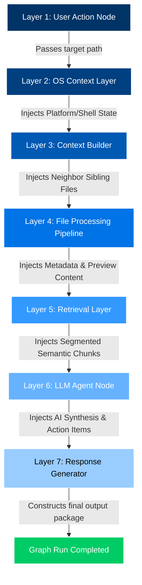

# Local Pilot — Stateful Agentic Pipeline Simulator (Stage 1)

This repository contains the pure-Python stateful agentic pipeline architecture simulator for **Local Pilot**, built entirely using `pydantic-graph` and `pydantic-ai`.

The system orchestrates a sequential **7-Layer Pipeline** to transition context from an OS user trigger all the way down to a highly structured AI executive synthesis and recommendations package.

---

## 🧬 The 7-Layer Agentic Architecture



### 1. **User Action (Trigger)** — `UserActionNode`
Captures the trigger context (simulated right-click context menu event in OS Explorer) and registers the selected target absolute path into the shared pipeline state.

### 2. **OS Context Layer** — `OsContextLayerNode`
Standardizes file paths and resolves system platform metrics (e.g., standardizing path formats, resolving platform OS, and setting execution shell type).

### 3. **Context Builder** — `ContextBuilderNode`
Gathers workspace metrics, directory information, and scrapes neighboring sibling files on your local filesystem to capture contextual environment details.

### 4. **File Processing Pipeline** — `FileProcessingPipelineNode`
Verifies file/folder readability and extracts target stats (extension, size indicator, modification timestamps).
* **For a File**: Reads the first 1000 characters for active preview synthesis.
* **For a Directory/Folder**: Generates a directory listing with child elements and counts.
* **Strict Existence Validation**: Raises a `FileNotFoundError` if the specified target path does not exist on disk.

### 5. **Retrieval Layer** — `RetrievalLayerNode`
Applies rule-based semantic boundary segmenting on the raw preview data, generating indexed `RetrievalChunk` payloads marked with mock relevancy similarity scores.

### 6. **LLM Agent** — `LlmAgentNode`
Invokes the custom `pydantic-ai` `LlmAgent` using your system prompt. Synthesizes the indexed semantic chunks into a structured Pydantic response (incorporating an executive summary, critical highlights, and concrete action bullets). Integrates robust mock synthesizers if model providers are not configured.

### 7. **Response Generator** — `ResponseGeneratorNode`
Packages the compiled state properties, prints a rich, visual output summary in your console, and constructs the final `PipelineCompleted` response to gracefully terminate graph execution.

---

## 📂 Repository File Structure

```text
local-pilot/
│
├── .venv/                      # Clean Python virtual environment
├── agentic_system/             # Core Pydantic Graph & Agent modules
│   ├── __init__.py             # Exposes module entrypoints
│   ├── config.py               # Configures model providers (Azure, OpenAI)
│   ├── models.py               # Shared graph State and structured Pydantic schemas
│   ├── prompts.py              # Strict analyst system prompts
│   ├── agents.py               # Pydantic AI LLM Agent with mock fallbacks
│   └── graph.py                # The 7 Pydantic Graph node definitions
│
├── main.py                     # Entrypoint pipeline simulation runner
├── example_context.py          # Sample python file context for simulation runs
├── requirements.txt            # Dependency file listing required libraries
├── README.md                   # System Architecture & Documentation
└── .env                        # Environment key registry
```

---

## ⚡ Setup & Execution

### 1. Install Dependencies
You can install dependencies inside your virtual environment using `uv` or `pip`:
```bash
# Install via uv
uv pip install -r requirements.txt

# Or install via standard pip
pip install -r requirements.txt
```

### 2. Run the Simulator
You can simulate the entire 7-layer pipeline execution dynamically by running:

#### 📂 Run on any File:
```bash
# Run with a custom target file (e.g. training.txt)
uv run main.py "C:\Users\adrian.patrick\OneDrive - InTimeTec Visionsoft Pvt. Ltd.,\Desktop\mine\training.txt"

# Run with a local target file
uv run main.py example_context.py
```

#### 📁 Run on any Directory/Folder:
```bash
# Run on the current workspace folder
uv run main.py .
```

#### ❌ Strict Existence Validation Check:
```bash
# Running on a non-existent path will correctly fail with FileNotFoundError
uv run main.py "C:\non_existent_folder_xyz\missing_file.txt"
```

---

## 🛠️ Configure Model API Keys (Optional)
The system supports full local offline synthesis by default if no keys are found. To enable real LLM generation, set your credentials inside the local `.env` file:
```env
# Standard OpenAI
OPENAI_API_KEY=your_key_here

# OR Azure OpenAI
AZURE_OPENAI_API_KEY=your_key_here
AZURE_OPENAI_ENDPOINT=https://your-resource.openai.azure.com/
AZURE_OPENAI_CHAT_DEPLOYMENT_NAME=gpt-4o-mini
AZURE_OPENAI_API_VERSION=2024-02-15-preview
```

---

## 🛠️ Verification Highlights

A successful run outputs a rich, structured visual block in the terminal:
```text
======================================================================
                 LOCAL PILOT PIPELINE OUTPUT SUMMARY
======================================================================
  FILE CONTEXT:  training.txt (TXT)
  FULL PATH:     C:\Users\adrian.patrick\OneDrive - InTimeTec Visionsoft Pvt. Ltd.,\Desktop\mine\training.txt
  FILE SIZE:     586 bytes
  LAST MODIFIED: 2026-04-09 10:01:14
----------------------------------------------------------------------
  EXECUTIVE SUMMARY:
    The notes are a terse checklist for Python virtual-environment and dependency management...

  KEY INSIGHTS & HIGHLIGHTS:
    - Implements pydantic-graph nodes for robust, stateful flow coordination.
    - Integrates with Pydantic AI for structured context synthesis.

  RECOMMENDED ACTION ITEMS:
    [ ] Clarify and correct terminology and typos (e.g., "dependancies" -> "dependencies").
    [ ] Produce a canonical, ordered setup sequence and save it as a README.

  CONFIDENCE METRIC: 82.0%
======================================================================
```
